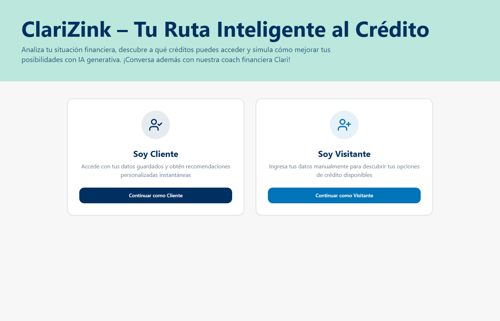
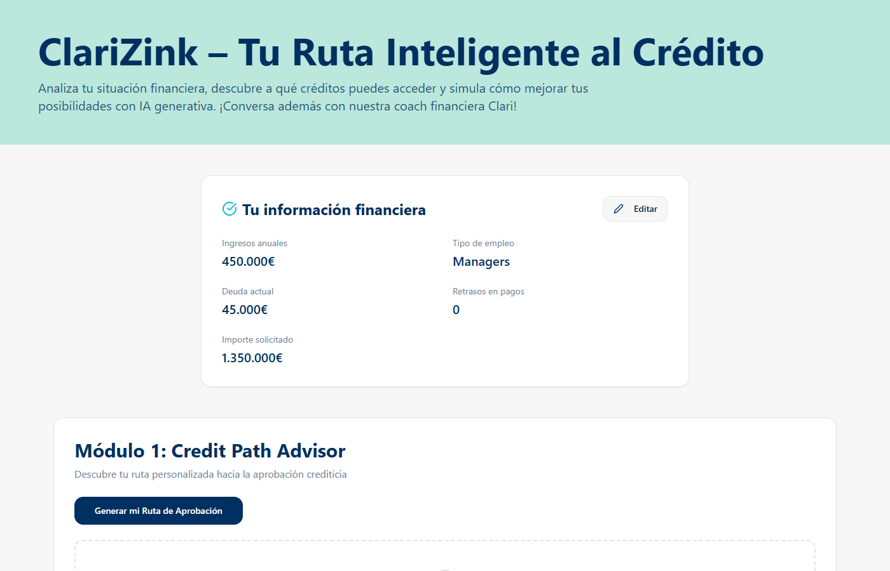
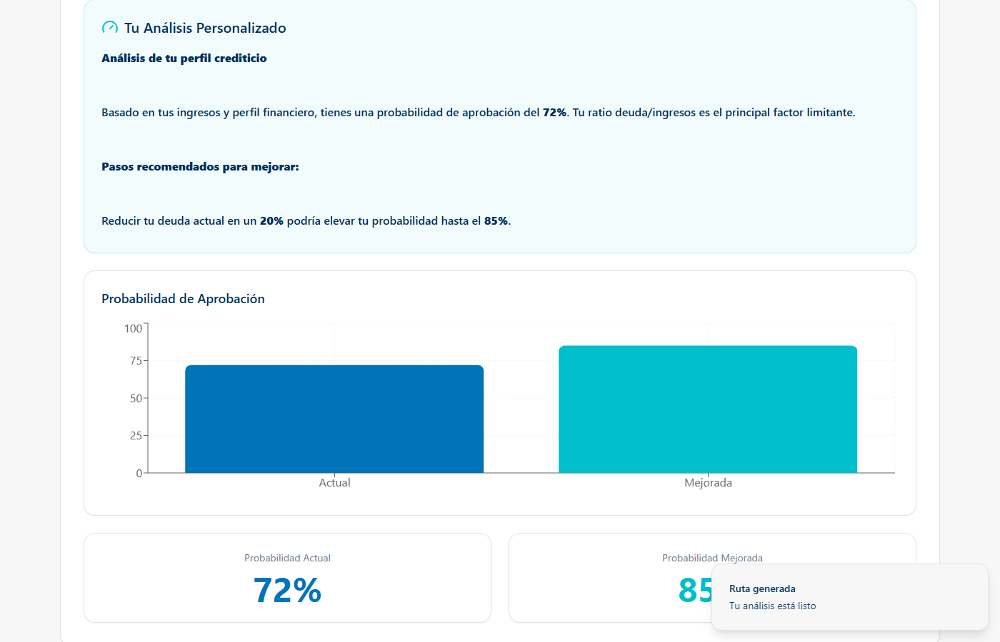
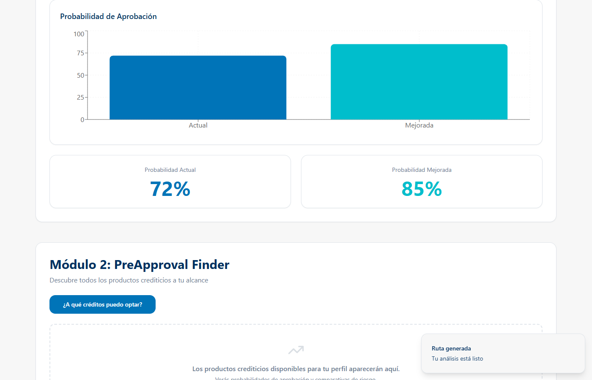
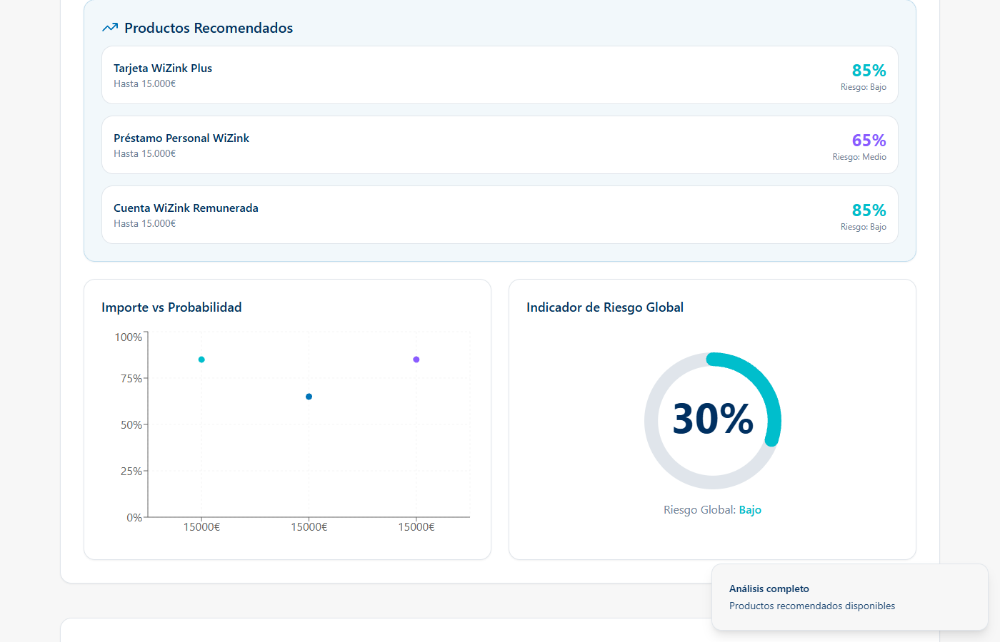
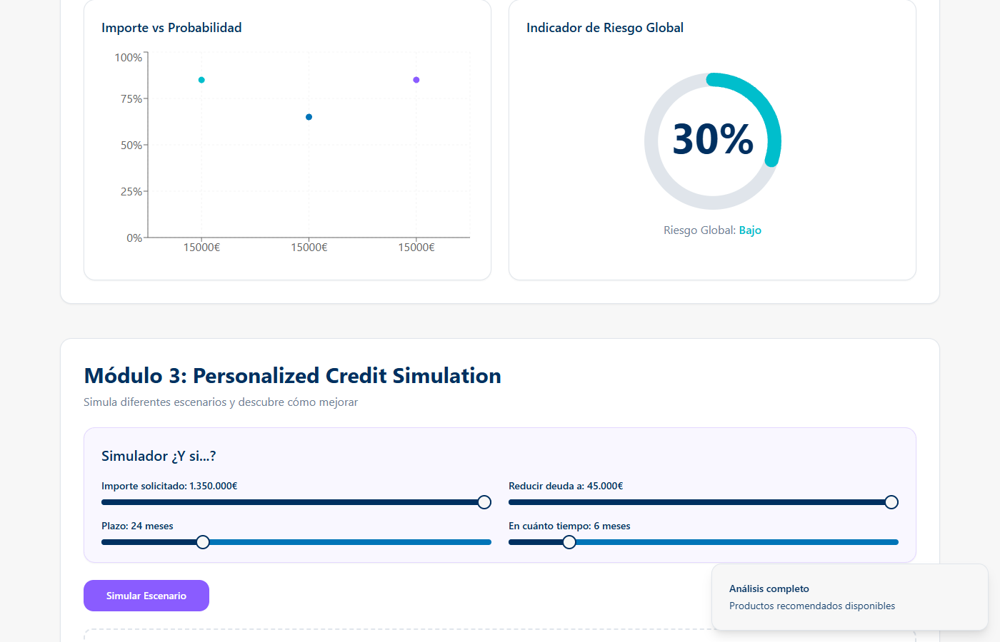
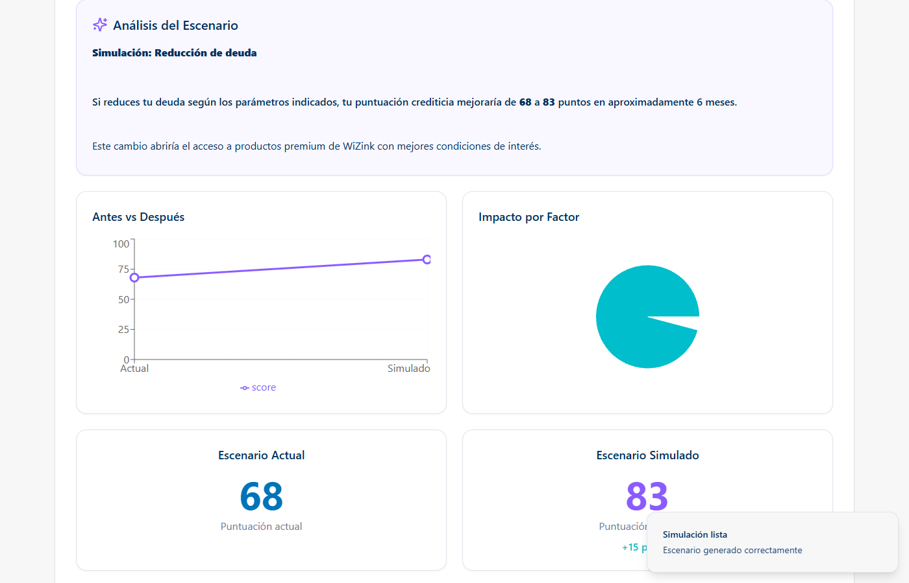
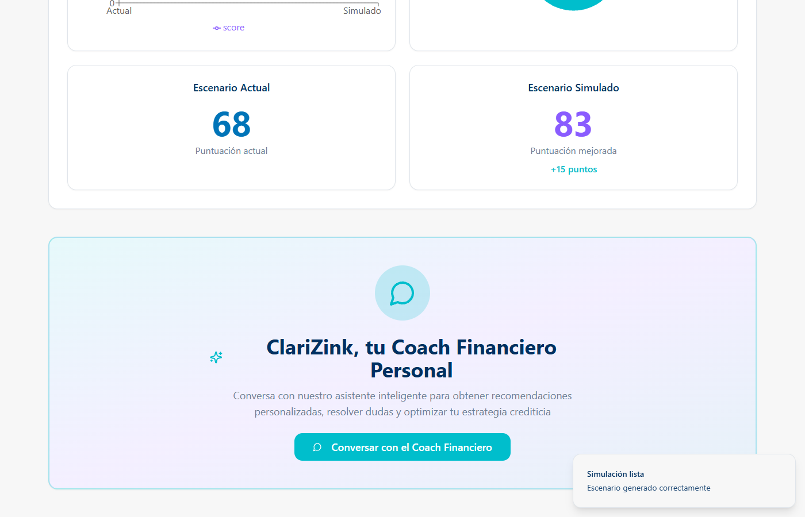
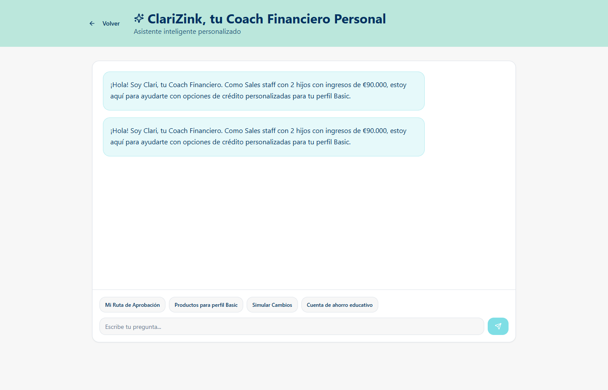
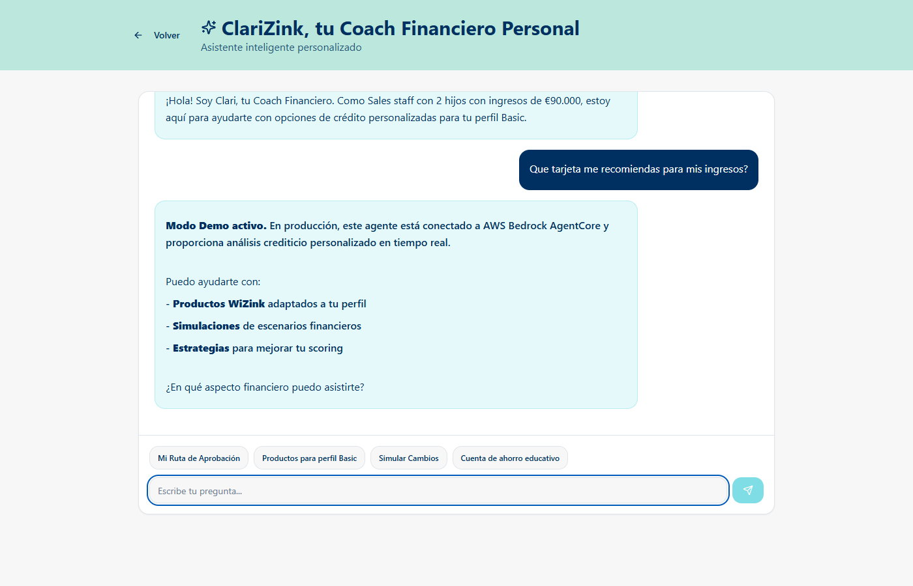

# ClariZink — Tu Ruta Inteligente al Crédito

> AI-powered financial advisor built for the **WiZink Hackathon**.
> Analyzes user financial profiles, recommends credit products, and provides personalized improvement roadmaps — all powered by AWS Bedrock AgentCore.

---

## Features

| Module | Description |
|---|---|
| **Credit Path Advisor** | Computes approval probability and generates an AI narrative with concrete improvement steps |
| **PreApproval Finder** | Matches the user's financial profile against available WiZink credit products |
| **Credit Simulation** | What-if scenario modeler — adjust debt, amount, and timeline to see score impact via interactive charts |
| **AI Financial Coach** | Conversational assistant (Clari) powered by AWS Bedrock AgentCore for open-ended financial Q&A |

---

## Demo

Run the app locally with **no backend required** using mock data:

```sh
VITE_DEMO_MODE=true npm run dev
```

All four AI modules return realistic mock responses so you can explore the full UI immediately.

---

## Tech Stack

| Layer | Technologies |
|---|---|
| Frontend | React 18, TypeScript, Vite |
| Styling | Tailwind CSS, shadcn/ui |
| Charts | Recharts |
| AI Backend | AWS Bedrock AgentCore |
| State | React Context API, TanStack Query |
| Routing | React Router v6 |

---

## Getting Started

### Prerequisites

- Node.js 18+
- npm

### Quick start (demo mode)

```sh
git clone https://github.com/agusuazo/ClariZink---Hackathon-Wizink
cd ClariZink---Hackathon-Wizink
npm install
cp .env.example .env          # defaults already set for demo mode
npm run dev
```

Open [http://localhost:8080](http://localhost:8080).

### Full setup (with backend)

```sh
cp .env.example .env
# Edit .env:
#   VITE_API_URL=<your-backend-url>
#   VITE_DEMO_MODE=false
npm run dev
```

The backend must expose a `POST /coach_financiero` endpoint that proxies to AWS Bedrock AgentCore.

### Environment Variables

| Variable | Default | Description |
|---|---|---|
| `VITE_API_URL` | `http://localhost:8000` | Backend API base URL |
| `VITE_DEMO_MODE` | `false` | Return mock data without a backend |

---

## Architecture

```
src/
├── components/
│   ├── MarkdownResponse.tsx      # Shared safe markdown renderer (no dangerouslySetInnerHTML)
│   ├── modules/
│   │   ├── CreditPathAdvisor.tsx # Module 1 — approval probability + AI narrative
│   │   ├── PreApprovalFinder.tsx # Module 2 — product matching
│   │   └── CreditSimulation.tsx  # Module 3 — what-if scenario charts
│   └── ui/                       # shadcn/ui primitives (button, card, input, slider…)
├── contexts/
│   └── AppContext.tsx             # Global state — user profile, module results, chat history
├── lib/
│   ├── api.ts                    # All API calls + demo mock data
│   └── userData.ts               # Static WiZink client profile data
└── pages/
    ├── Index.tsx                  # Landing page + module dashboard
    ├── Coach.tsx                  # AI Financial Coach chat interface
    └── NotFound.tsx
```

### Data flow

```
User fills profile (UserDataCard)
        │
        ▼
AppContext stores UserData
        │
        ├──► CreditPathAdvisor ──► POST /coach_financiero ──► AWS Bedrock
        ├──► PreApprovalFinder ──► POST /coach_financiero ──► AWS Bedrock
        ├──► CreditSimulation  ──► POST /coach_financiero ──► AWS Bedrock
        └──► Coach (chat)      ──► POST /coach_financiero ──► AWS Bedrock
```

All AI traffic goes through a single backend endpoint. AWS credentials live server-side only.

---

## Screenshots

### Landing — user type selector


### Dashboard — user profile + module buttons


### Module 1 — Credit Path Advisor (AI narrative + probability chart)



### Module 2 — PreApproval Finder (product list + risk charts)



### Module 3 — Credit Simulation (what-if scenario + before/after scores)



### AI Financial Coach — Clari (chat interface + demo reply)



---

## License

MIT — see [LICENSE](LICENSE).
